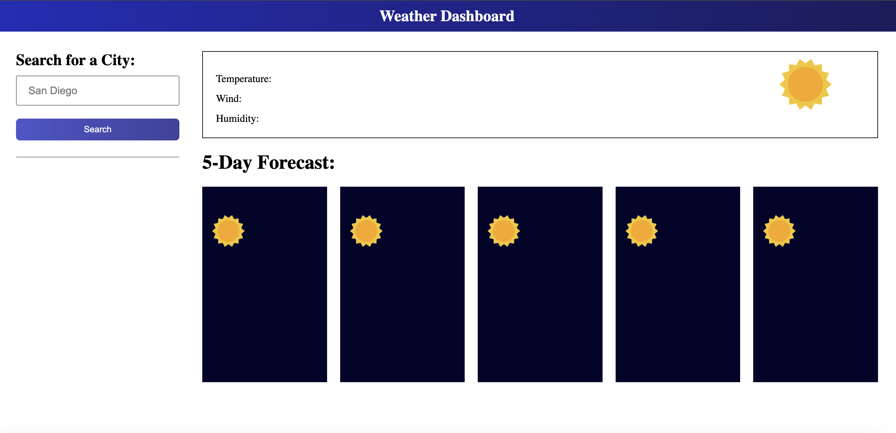

# Weather Dashboard

## User Story

```
AS A traveler
I WANT to see the weather outlook for multiple cities
SO THAT I can plan a trip accordingly
```

## Acceptance Criteria

```
GIVEN a weather dashboard with form inputs
WHEN I search for a city
THEN I am presented with current and future conditions for that city and that city is added to the search history
WHEN I view current weather conditions for that city
THEN I am presented with the city name, the date, an icon representation of weather conditions, the temperature, the humidity, and the wind speed
WHEN I view future weather conditions for that city
THEN I am presented with a 5-day forecast that displays the date, an icon representation of weather conditions, the temperature, the wind speed, and the humidity
WHEN I click on a city in the search history
THEN I am again presented with current and future conditions for that city
```

## Usage

Users can search for a city's weather forecast using the input field. The weather forecast for the selected city will then be displayed. Additionally, a history of previously searched cities will be shown as clickable buttons, allowing users to quickly access weather information for those cities.

The following image shows the web application's appearance and functionality:

When the user opens the page:


After searching for a few cities:


## License

MIT License

---

© Adriana Nino. [Github Repo](https://github.com/ninadri/weather-api). [Weather Dashboard Site](https://ninadri.github.io/weather-api/).
